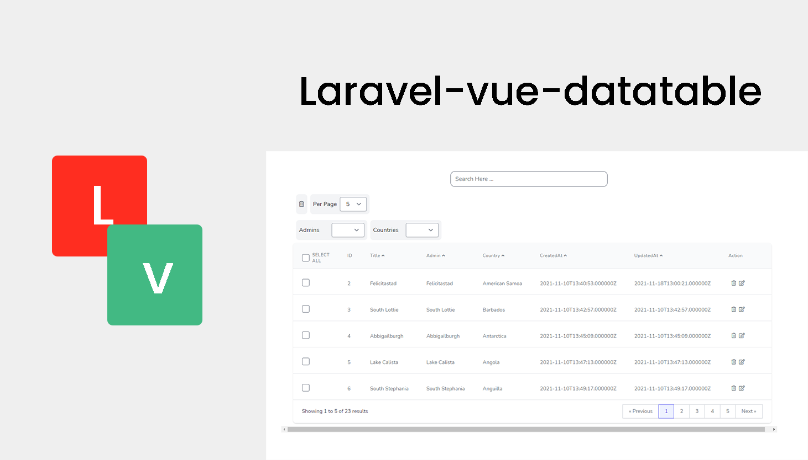

<h2 align="center">Supporting Laravel-vue-datatable</h2>

- [Become sponsor on Patreon](https://www.patreon.com/yazan_alnughnugh).
- [One-time donation via crypto-currencies](https://github.com/yazan-alnugnugh/laravel-datatable/blob/master/_docs/Donations/crypto/index.md).


# Introduction

<p align="center">
    
</p>

**if you want to make dataTable easy and quickly with crazy features, this package is for you.**

These two Laravel packages are for making easy and quickly dataTable for your work, the goal is creating Datatable an easy way using ajax, 
with interesting features,  just  with little steps, you  can create it

## Demo

 [DataTable Demo](https://packages.tourismcaravan.com/data-table)


## Table of contents

  1. [Introduction](1-introduction.md)
      * [Quick Example](#Quick-Example)
  2. [Installation and Setup](2-Installation-and-Setup.md)
  3. [Configuration](3-Configuration.md)
  4. [Usage](4-Usage.md)
  5. [Donations](https://github.com/yazan-alnugnugh/laravel-datatable/blob/master/_docs/Donations/crypto/index.md)


## Quick Example

### **Start create Grid Class**

```php
// app/DataGrid/PostGrid.php

<?php


namespace App\DataGrid;

use Yazan\DataTable\DataGrid;

class PostGrid extends DataGrid
{

    public $model = "App\Models\Post";


}

```

### **Make an instance from PostGrid class and return the collection**

```php
// app/Http/Controller/PostController.php

public function all(Request $request)
{ 
  $posts = (new PostGrid())->render();
    
  return ['success' => true, 'collection' => $posts];

}

```

### **use the data-table component in your blade**

```html
// resources/posts/index.blade.php
    <data-table
        :config="{
        url: `posts/all?page=1`,
            },
        }"
        :columns="[
        {
        label: 'ID',
        column: 'id',
        show: true,
            sort:{
              sortable: false,
              sortColumn: 'id',

            },

       },
        {
        label: 'Title',
        column: 'title',
         show: true,
            sort:{
             sortable: true,
             sortColumn: 'title',
             sortDir: 'asc',
            },
       },
       {
        label: 'CreatedAt',
        column: 'created_at',
        show: true,
             sort:{
                sortable: true,
                sortColumn: 'created_at',
                sortDir: 'asc',
             },
       },
       {
        label: 'UpdatedAt',
        column: 'updated_at',
        show: true,
             sort:{
                sortable: true,
                sortColumn: 'updated_at',
                sortDir: 'asc',
             },
       },
        ]
        "

    ></data-table>
```
