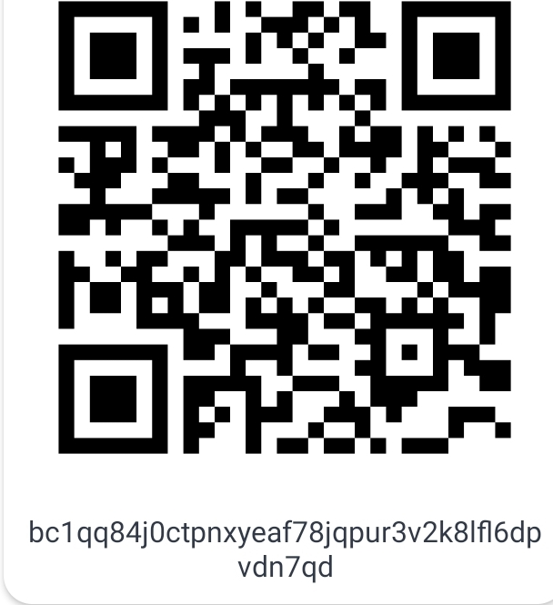
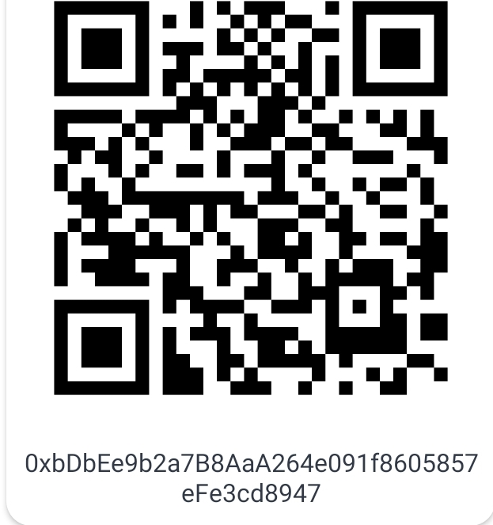
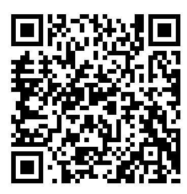

## Table of contents

  1. [Introduction](https://github.com/yazan-alnugnugh/laravel-datatable/blob/master/_docs/1-introduction.md)
  2. [Installation and Setup](https://github.com/yazan-alnugnugh/laravel-datatable/blob/master/_docs/2-Installation-and-Setup.md)
  3. [Configuration](https://github.com/yazan-alnugnugh/laravel-datatable/blob/master/_docs/3-Configuration.md)
  4. [Usage](https://github.com/yazan-alnugnugh/laravel-datatable/blob/master/_docs/4-Usage.md)
  5. [Donations](https://github.com/yazan-alnugnugh/laravel-datatable/blob/master/_docs/Donations/crypto/index.md)
    

## BTC

    

## ETH

    

## USDT

    

